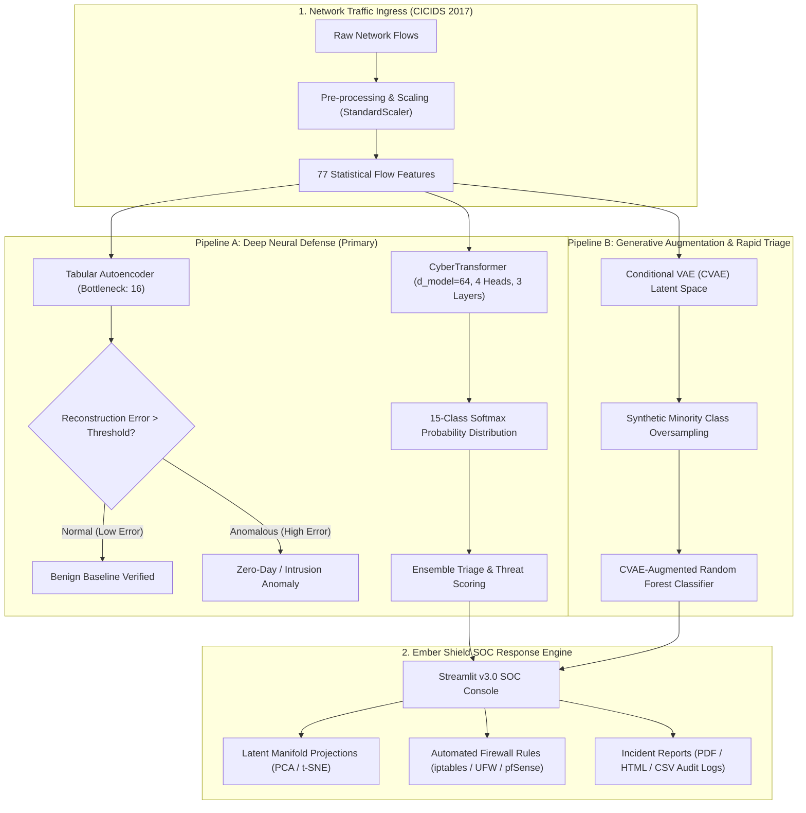
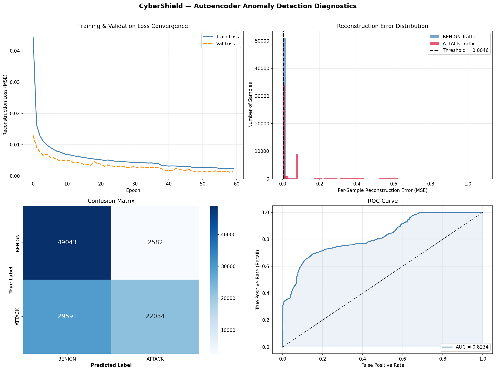
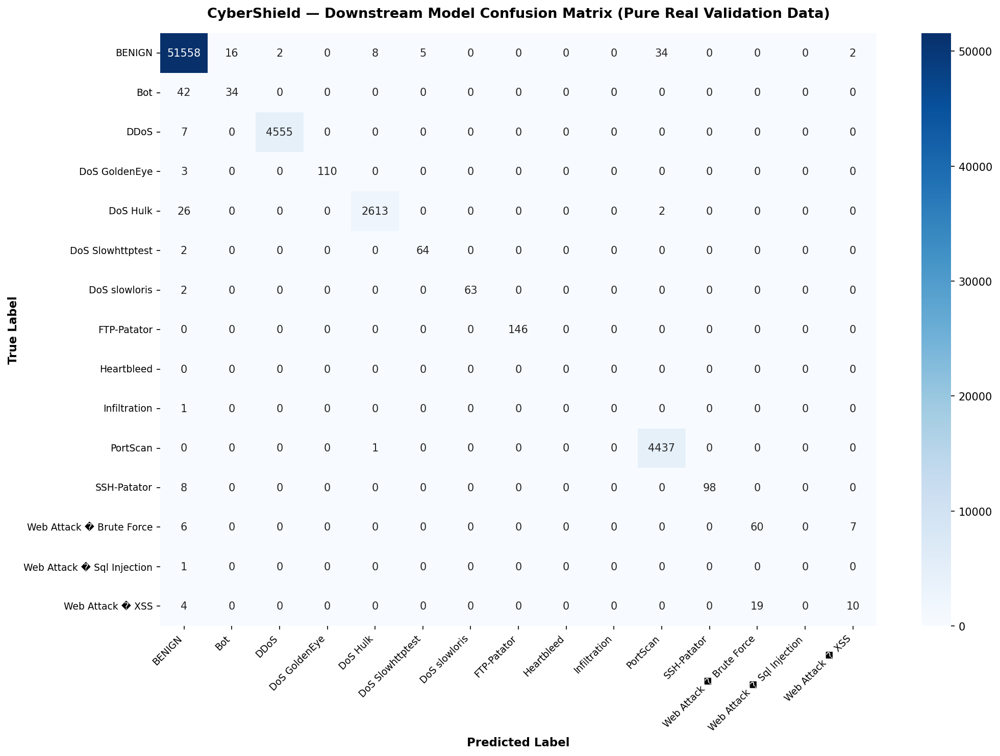
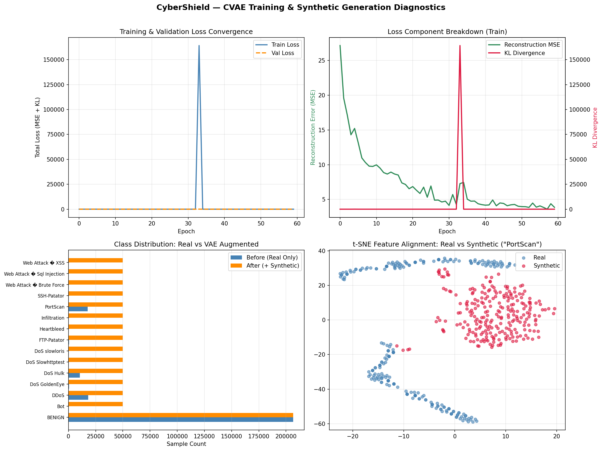
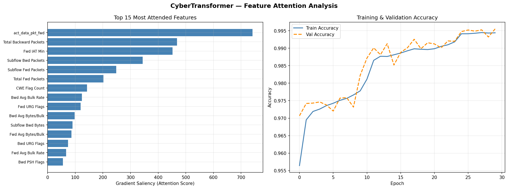

# 🛡️ CyberShield — AI-Powered Next-Gen Network Intrusion Detection System (NIDS)

<div align="center">

[](https://www.python.org/)
[](https://pytorch.org/)
[](https://streamlit.io/)
[](https://scikit-learn.org/)
[](https://plotly.com/)
[](https://github.com/Pranaykarmankar/Cyber-shield)
[](LICENSE)

<p align="center">
  <b>A hybrid Deep Learning & Generative AI defense framework combining Deep Tabular Autoencoders, Multi-Head Self-Attention Transformers, and Conditional Variational Autoencoders (CVAE) for zero-day anomaly detection and multi-class cyberattack triage.</b>
</p>

[Key Features](#-key-features) • [System Architecture](#-system-architecture) • [Benchmarks & Results](#-benchmark-performance--metrics) • [Dashboard Overview](#-ember-shield-dashboard-v30) • [Installation](#-installation--quickstart) • [Repository Structure](#-repository-structure)

</div>

---

## 📌 Overview

Modern enterprise and cloud networks face unprecedented volumes of sophisticated cyber threats—ranging from stealthy brute-force penetration attempts to high-throughput Distributed Denial of Service (DDoS) campaigns. Traditional signature-based Intrusion Detection Systems (IDS) frequently fail against zero-day exploits, polymorphism, and highly imbalanced attack vectors.

**CyberShield** addresses these challenges by uniting unsupervised reconstruction modeling, self-attention neural architectures, and generative data synthesis:

1. **Unsupervised Anomaly Filter (Autoencoder):** Reconstructs baseline benign traffic flow vectors to flag anomalous deviations and zero-day threats without requiring prior signatures.
2. **Self-Attention Attack Classifier (CyberTransformer):** Leverages multi-head self-attention mechanisms over 77 tabular flow features to capture subtle inter-feature dependencies and identify 15 distinct attack types.
3. **Generative Class-Balancing (CVAE):** Employs Conditional Variational Autoencoders to synthesize realistic minority-class attack samples (e.g., Infiltration, Web Attacks, Botnets) to resolve extreme real-world class imbalance.
4. **Ember Shield SOC Dashboard:** A cyberpunk-styled, glassmorphic Streamlit operations console with real-time live traffic simulation, batch flow inspection, PCA/t-SNE latent manifold projections, automated firewall rule generation (iptables, UFW, pfSense), and exportable incident audit reports.

---

## 🏗️ System Architecture

CyberShield implements a modular, dual-pipeline detection paradigm:



### Pipeline A: Autoencoder + CyberTransformer (Primary)
- **Deep Tabular Autoencoder:** Compresses 77 flow dimensions through progressive dense layers (`77 -> 128 -> 64 -> 16 bottleneck -> 64 -> 128 -> 77`) with LeakyReLU activations and BatchNorm. Packets with mean squared reconstruction error exceeding the dynamically calibrated threshold (`τ = 0.005`) are triaged as anomalies.
- **CyberTransformer:** Treats normalized flow features as an embedded sequence passed through a 3-layer Transformer Encoder with 4 parallel attention heads and feedforward expansion. Produces multi-class attack probabilities with high confidence calibration.

### Pipeline B: CVAE + Random Forest (Generative Benchmark)
- **Conditional Variational Autoencoder (CVAE):** Learns a class-conditioned latent Gaussian distribution $\mathcal{N}(\mu, \sigma^2)$ to generate realistic synthetic telemetry for underrepresented classes (such as Web Attacks, Infiltration, and Botnets), avoiding synthetic mode collapse.
- **Random Forest Classifier:** Rapid tabular decision tree ensemble trained on balanced, CVAE-augmented datasets for sub-millisecond inference scenarios.

---

## 📊 Benchmark Performance & Metrics

Evaluated against **63,946 real validation packets** extracted from the **CICIDS 2017** benchmark dataset:

### Overall System Summary
| Evaluation Metric | Score | Evaluation Scope & Meaning |
|:---|:---:|:---|
| **Overall System Accuracy** | **99.69%** | Top-line detection rate across 63,946 validation packets |
| **Weighted Average F1-Score** | **0.9967** | Reflects system capability weighted by real-world traffic volume |
| **Macro Average F1-Score** | **0.7557** | Unweighted mean reflecting performance across rare attack vectors |
| **Autoencoder ROC-AUC** | **0.8234** | Threshold-independent anomaly separability score |
| **Autoencoder Attack Precision** | **89.51%** | Proportion of flagged anomalies that were true attacks |

### Per-Class Detection Breakdown
| Attack Class | Real Val Support | Precision | Recall | F1-Score | Operational Reliability Status |
|:---|:---:|:---:|:---:|:---:|:---|
| **BENIGN** | 51,625 | **0.9980** | **0.9987** | **0.9984** | ✅ Production Ready (High Volume) |
| **DDoS** | 4,562 | **0.9996** | **0.9985** | **0.9990** | ✅ Production Ready (High Volume) |
| **PortScan** | 4,438 | **0.9920** | **0.9998** | **0.9958** | ✅ Production Ready (High Volume) |
| **DoS Hulk** | 2,641 | **0.9966** | **0.9894** | **0.9930** | ✅ Production Ready (High Volume) |
| **FTP-Patator** | 146 | **1.0000** | **1.0000** | **1.0000** | ✅ Production Ready (Zero False Positives) |
| **DoS GoldenEye** | 113 | **1.0000** | **0.9735** | **0.9865** | ✅ Production Ready |
| **SSH-Patator** | 106 | **1.0000** | **0.9245** | **0.9608** | ✅ Production Ready |
| **DoS slowloris** | 65 | **1.0000** | **0.9692** | **0.9844** | ✅ Production Ready |
| **DoS Slowhttptest** | 66 | **0.9275** | **0.9697** | **0.9481** | ✅ Production Ready |
| **Web Attack – Brute Force** | 73 | **0.7595** | **0.8219** | **0.7895** | ⚠️ Payload Inspection Recommended |
| **Bot** | 76 | **0.6800** | **0.4474** | **0.5397** | ⚠️ C2 Heartbeat Analysis Recommended |
| **Web Attack – XSS** | 33 | **0.5263** | **0.3030** | **0.3846** | ⚠️ WAF Layer Corroboration Needed |
| **Infiltration** | 1 | 0.0000 | 0.0000 | 0.0000 | 🔬 Generative Limit ($N < 10$) |
| **Web Attack – SQL Injection** | 1 | 0.0000 | 0.0000 | 0.0000 | 🔬 Generative Limit ($N < 10$) |
| **Heartbleed** | 0 | 0.0000 | 0.0000 | 0.0000 | 🔬 Zero-day Holdout Set |

---

## 📈 Model Diagnostics & Visualizations

### 1. Autoencoder Anomaly Diagnostics
Reconstruction error distributions, threshold calibration curve, ROC curve, and classification breakdown:

<div align="center">
  
</div>

---

### 2. Multi-Class Confusion Matrix
Confusion matrix showing separation between benign traffic, denial of service variants, port sweeps, and brute force intrusions:

<div align="center">
  
</div>

---

### 3. Conditional VAE Training & Latent Convergence
Reconstruction loss (MSE reduced from 27.15 to 3.86) and KL divergence regularizing the generative latent space:

<div align="center">
  
</div>

---

### 4. Transformer Attention Weights
Attention map across statistical traffic attributes, highlighting which flow features triggered classification:

<div align="center">
  
</div>

---

## 🖥️ Ember Shield Dashboard (v3.0)

CyberShield features a Streamlit SOC management console crafted with custom cyberpunk CSS, glowing glassmorphism, and responsive Plotly visual analytics:

- **📡 Live Packet Stream Simulator:** Simulates real-time network traffic feeds with configurable speed (100ms to 2s intervals), live threat counters, and animated radar sweeps.
- **📂 Batch CSV Inspector:** Upload any network capture CSV formatted with the 77 standard CICIDS 2017 features to instantly run deep neural inference.
- **🔬 Latent Space Manifold:** Interactive 2D and 3D PCA and t-SNE projections illustrating clustering of normal vs. malicious packets in the bottleneck space.
- **🛡️ Dynamic Firewall Rule Synthesizer:** Instantly outputs copy-paste defensive rules tailored to detected threats:
  * Linux `iptables` rules
  * Ubuntu `ufw` commands
  * pfSense XML / CLI block rules
  * AWS VPC Network ACL statements
- **📄 Incident Report Generator:** Automatically generates exportable HTML, formatted Markdown, and CSV incident summaries for SOC audit logs.

---

## 📂 Repository Structure

```text
Cyber-shield/
│
├── cybershield_app.py                   # Ember Shield Streamlit GUI application (v3.0)
│
├── autoencoder.ipynb                    # PyTorch Tabular Autoencoder training notebook
├── transformer.ipynb                    # PyTorch CyberTransformer training notebook
├── cybershield-vae-model.ipynb          # CVAE Generative Model & Random Forest notebook
│
├── cybershield_ae.pth                   # Trained Autoencoder PyTorch weights
├── best_ae.pth                          # Best Autoencoder checkpoint
├── ae_scaler.pkl                        # StandardScaler fitted on AE training set
│
├── cybershield_transformer.pth          # Trained CyberTransformer PyTorch weights
├── best_transformer.pth                 # Best CyberTransformer checkpoint
├── transformer_scaler.pkl               # StandardScaler fitted for Transformer
├── transformer_label_encoder.pkl        # LabelEncoder mapping 15 attack classes
│
├── scaler.pkl                           # StandardScaler for VAE/RF pipeline
├── label_encoder.pkl                    # LabelEncoder for VAE/RF pipeline
│
├── generate_test_csv.py                 # Generates 50 realistic CICIDS 2017 test packets
├── generate_balanced_csv.py             # Generates balanced multi-class test CSV
├── generate_fast_mixed_csv.py           # Rapid mixed traffic generator
│
├── test_traffic.csv                     # Sample test traffic CSV (ready to upload)
├── cybershield_mixed_traffic.csv        # Mixed attack test traffic CSV
│
├── overall_system_metrics.csv           # Global benchmark statistics
├── per_class_evaluation_matrix.csv      # Detailed per-class precision, recall, F1
├── ae_detection_performance.csv         # Autoencoder anomaly evaluation metrics
├── ae_confusion_matrix_breakdown.csv    # AE confusion matrix values
├── ae_reconstruction_error_stats.csv    # Reconstruction error quantiles
├── ae_training_summary.csv              # AE training epoch logs
├── cvae_loss_matrix.csv                 # CVAE MSE & KL divergence progression
│
├── ae_diagnostics_dashboard.png         # AE diagnostic visualizations
├── cvae_diagnostics_dashboard.png       # CVAE training & distribution plots
├── intrusion_classifier_confusion_matrix.png # Multi-class confusion matrix plot
├── transformer_attention.png            # Transformer feature attention heatmap
│
├── requirements.txt                     # Python package dependencies
├── .gitignore                           # Git ignore rules
└── README.md                            # Comprehensive project documentation
```

> **Note on `rf_model.pkl`:** The Random Forest checkpoint (~754 MB) used in the secondary CVAE experimental pipeline exceeds GitHub's 100 MB hard file upload limit. It is excluded from the Git tree via `.gitignore`. The primary pipeline (**Autoencoder + CyberTransformer**) is fully self-contained with bundled weights (`cybershield_ae.pth` and `cybershield_transformer.pth`). If you wish to use the Random Forest pipeline locally, you can easily train and export `rf_model.pkl` in minutes by running [`cybershield-vae-model.ipynb`](cybershield-vae-model.ipynb).

---

## 🚀 Installation & Quickstart

### 1. Clone the Repository
```bash
git clone https://github.com/Pranaykarmankar/Cyber-shield.git
cd Cyber-shield
```

### 2. Create and Activate a Virtual Environment
```bash
# Windows
python -m venv venv
.\venv\Scripts\activate

# Linux / macOS
python3 -m venv venv
source venv/bin/activate
```

### 3. Install Dependencies
```bash
pip install -r requirements.txt
```

### 4. Launch the Ember Shield Dashboard
```bash
streamlit run cybershield_app.py
```
Open your browser at `http://localhost:8501` to view the live dashboard.

---

## 🧪 Testing with Sample Traffic

You can immediately test the detection engine using either the provided sample datasets or the traffic generators:

### Method A: Use Pre-generated CSVs
In the Streamlit sidebar, select **"Upload Traffic CSV"** and pick:
- `test_traffic.csv` (contains a mix of Benign, DDoS, DoS, PortScan, and Brute Force flows)
- `cybershield_mixed_traffic.csv` (contains multi-class attack profiles)

### Method B: Generate Fresh Test Traffic
Run the standalone data generation scripts to create new synthetic packets adhering to the 77 CICIDS feature specifications:
```bash
# Generate 50 realistic CICIDS 2017 flows with metadata
python generate_test_csv.py

# Generate a balanced dataset across all attack profiles
python generate_balanced_csv.py
```

---

## 🧠 Feature Specification (CICIDS 2017)

CyberShield operates on 77 statistical network flow features extracted from bidirectional packet captures:

<details>
<summary><b>Click to expand the 77 feature catalog</b></summary>

| Category | Features |
|:---|:---|
| **Flow Identifiers** | `Destination Port`, `Flow Duration` |
| **Packet Counts** | `Total Fwd Packets`, `Total Backward Packets`, `Subflow Fwd Packets`, `Subflow Bwd Packets` |
| **Payload Lengths** | `Total Length of Fwd Packets`, `Total Length of Bwd Packets`, `Fwd Packet Length Max/Min/Mean/Std`, `Bwd Packet Length Max/Min/Mean/Std`, `Min/Max/Mean/Std/Variance Packet Length`, `Average Packet Size`, `Avg Fwd/Bwd Segment Size`, `Subflow Fwd/Bwd Bytes` |
| **Flow Rates** | `Flow Bytes/s`, `Flow Packets/s`, `Fwd Packets/s`, `Bwd Packets/s` |
| **Inter-Arrival Times (IAT)** | `Flow IAT Mean/Std/Max/Min`, `Fwd IAT Total/Mean/Std/Max/Min`, `Bwd IAT Total/Mean/Std/Max/Min` |
| **TCP Flags** | `Fwd/Bwd PSH Flags`, `Fwd/Bwd URG Flags`, `FIN Flag Count`, `SYN Flag Count`, `RST Flag Count`, `PSH Flag Count`, `ACK Flag Count`, `URG Flag Count`, `CWE Flag Count`, `ECE Flag Count` |
| **Header Metrics** | `Fwd Header Length`, `Bwd Header Length`, `Fwd Header Length.1`, `Down/Up Ratio`, `Init_Win_bytes_forward/backward`, `act_data_pkt_fwd`, `min_seg_size_forward` |
| **Bulk Rates** | `Fwd Avg Bytes/Bulk`, `Fwd Avg Packets/Bulk`, `Fwd Avg Bulk Rate`, `Bwd Avg Bytes/Bulk`, `Bwd Avg Packets/Bulk`, `Bwd Avg Bulk Rate` |
| **Active & Idle Times** | `Active Mean/Std/Max/Min`, `Idle Mean/Std/Max/Min` |

</details>

---

## 🔒 Defensive Security Disclaimer

> **Notice:** CyberShield is engineered strictly for authorized network defense, intrusion detection, academic benchmarking, and cybersecurity research. All synthetic attack profiles and test scripts are designed to evaluate and enhance defensive postures in compliance with ethical cybersecurity guidelines.

---

## 👤 Author & Acknowledgments

- **Lead Developer:** [Pranay Karmankar](https://github.com/Pranaykarmankar)
- **Dataset Reference:** Canadian Institute for Cybersecurity (CIC) — [CICIDS 2017 Dataset](https://www.unb.ca/cic/datasets/ids-2017.html)
- **Frameworks:** [PyTorch](https://pytorch.org/), [Streamlit](https://streamlit.io/), [Scikit-Learn](https://scikit-learn.org/), [Plotly](https://plotly.com/)

---

<div align="center">
  <sub>Built with ❤️ by Pranay Karmankar. Star ⭐ this repository if you find it helpful!</sub>
</div>
